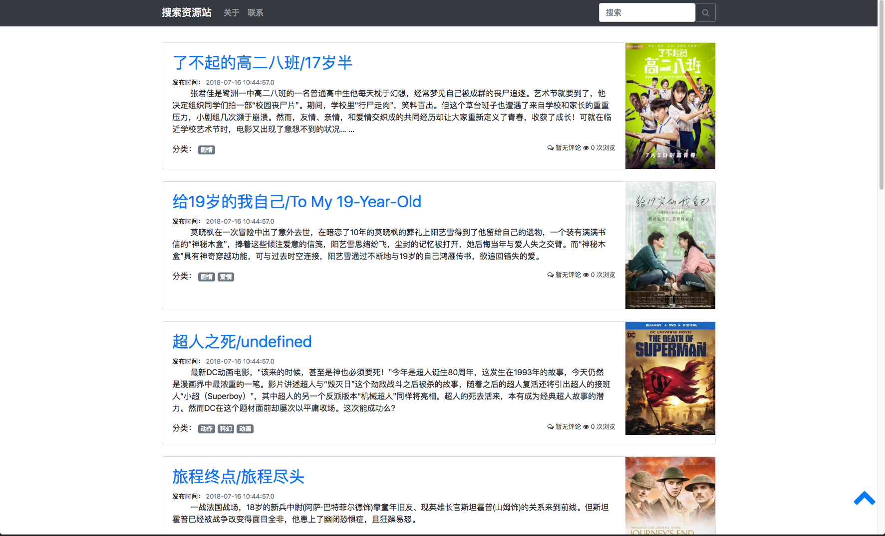
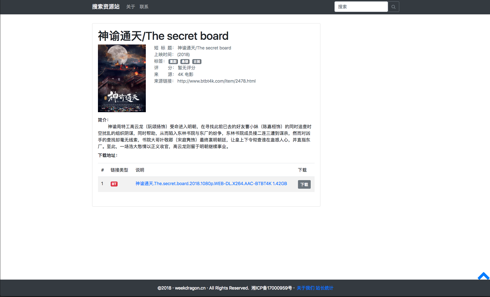
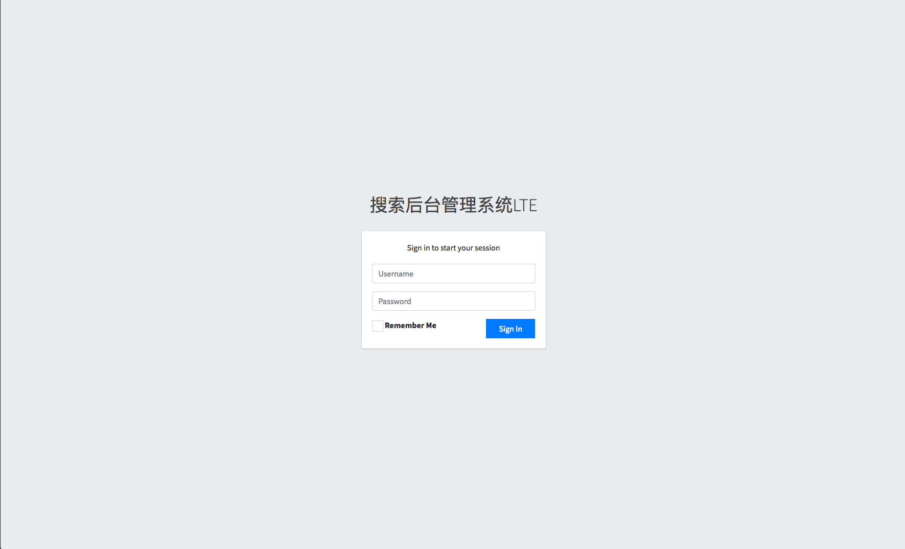
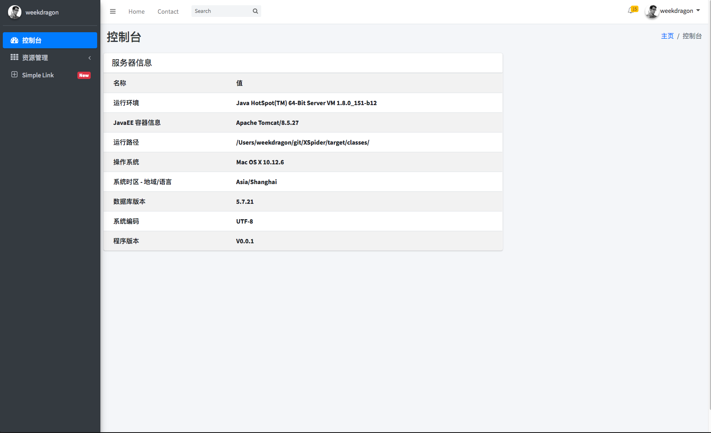
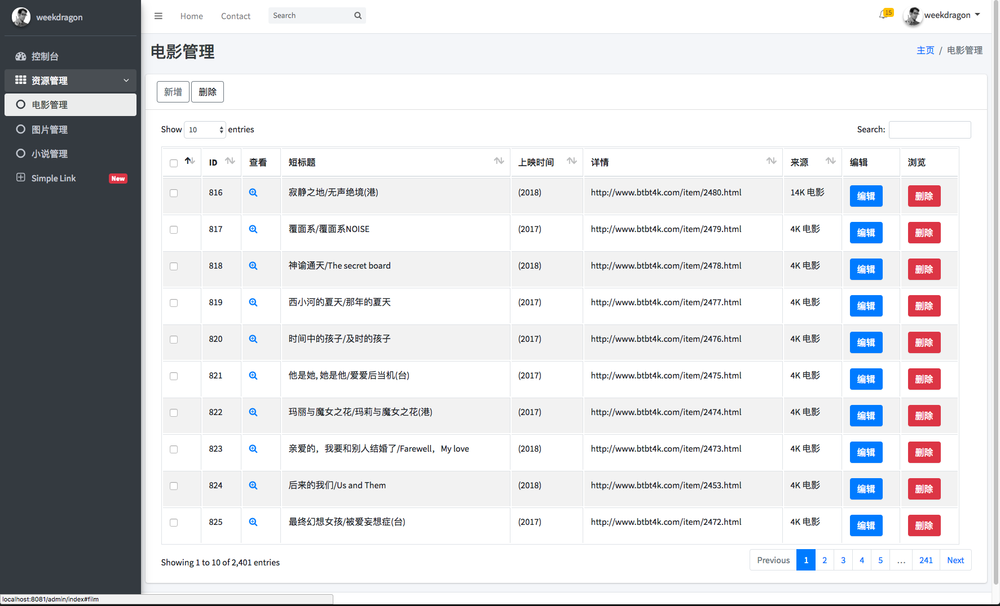
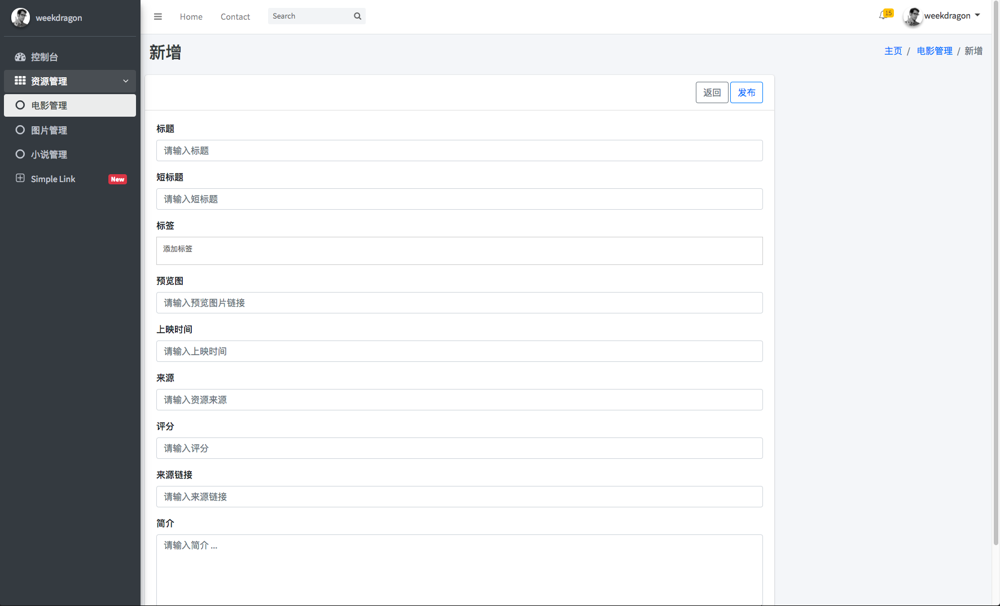
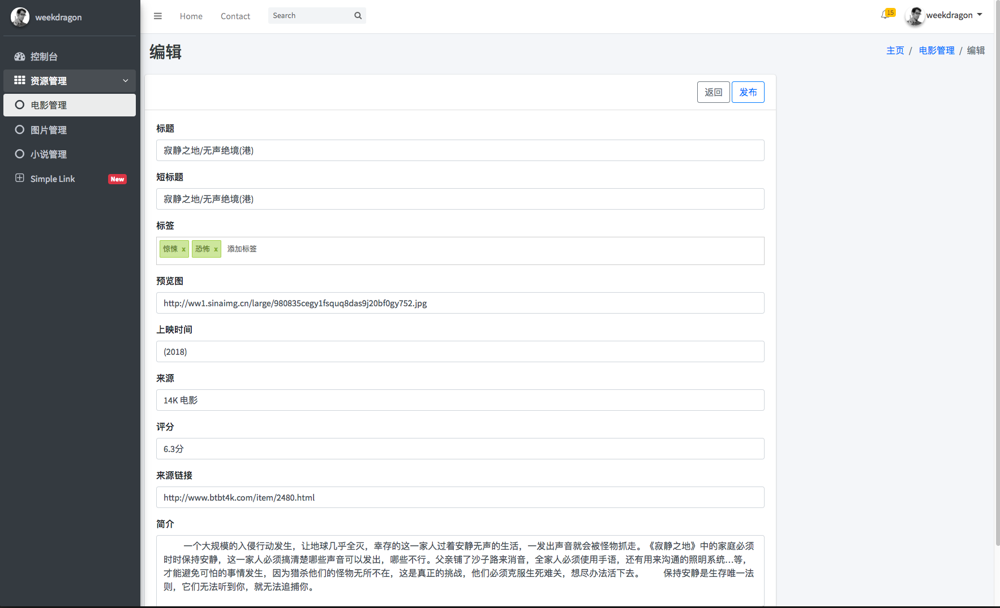

# XSpider

想要做网站，又苦于没有数据源，懒得管理，于是决定用爬虫。目前正在开发电影爬虫中。

## 图片预览
* 主页

  

* 电影详情

  

* 后端登录页面

  

* 后端主页

  

* 后端电影管理页面

  

* 后端电影新增页面

  

* 后端电影编辑页面

  

## 使用方式

* 下载代码 git clone https://github.com/weekdragon/XSpider.git
* 配置好 src/main/resources 下的一些属性，比如数据库连接信息，端口号等，若是第一次安装最好设置 **xspider.fetchAll** 为 true 这样爬虫程序会初始化抓取所有网站的全部电影数据
* 项目利用 Maven 构建，执行 mvn clean package 打包，若无意外，在 target 目录下可以发现打包成功jar
* java -jar xxx.jar 执行，一切成功即可在浏览器相应端口访问到项目主页

## 架构

本项目采用 SpringBoot 、SpringMVC、SpringData 框架，页面展示主要用了 Bootstrap4.0，数据渲染采用 Thymeleaf 引擎，后端管理系统用了 AdminLTE 模版，支持 ajax 无刷新页面浏览，刷新页面后记住访问位置，数据库采用 MySQL 5.6。

目前爬虫和WEB项目是结合的，爬虫服务作为 Component，通过定时任务每小时爬取网站的最新电影数据，并且做了去重处理。

未来考虑爬虫程序加大以及网站功能的增多，方便单独部署，可能会拆分成两个项目。

## 功能列表

打勾的表示已经完成的功能，其他功能目前正在开发中

- [x] 电影资源抓取
- [x] 电影分页显示
- [x] 电影全文搜索
- [x] 后端登录以及 session 持久化
- [x] 后端管理电影资源
- [x] 电影详情页面查看
- [x] 电影点击次数统计
- [ ] 电影标签分类搜索
- [ ] 支持评论
- [ ] 后端手动抓取
- [ ] 后端日志查看
- [ ] ...

各位有什么好的意见或者使用中发现 bug 可以通过 issue 提出来，也可以直接给我发邮件

## 许可证

[MIT](LICENSE "MIT")